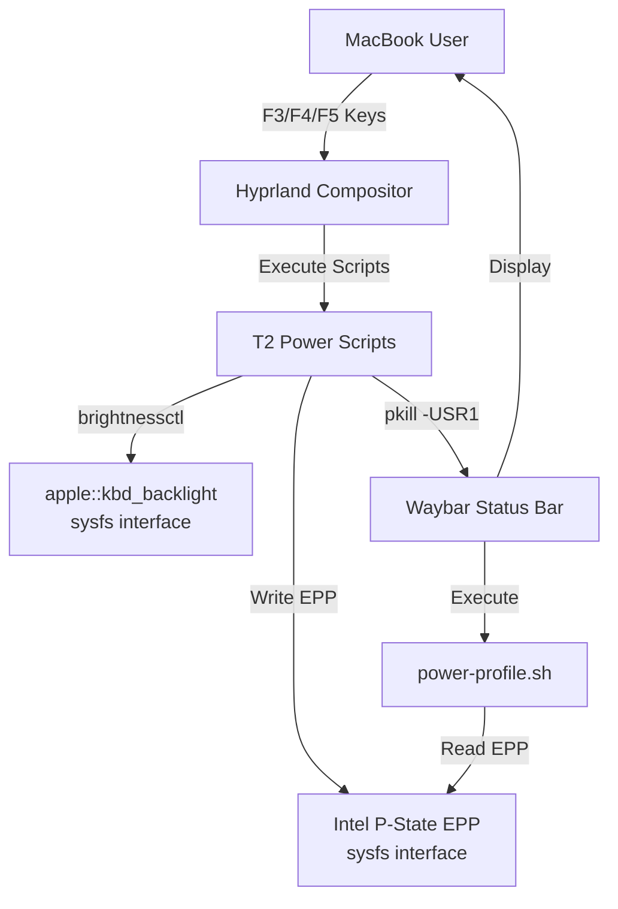
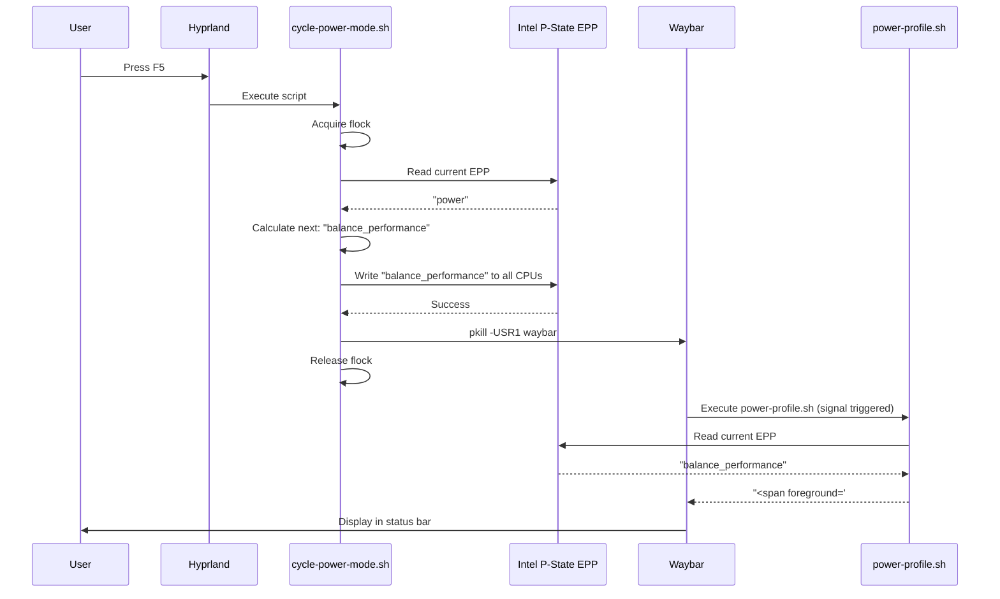

# Solution Design Document: MacBook T2 Migration

## Overview

This SDD defines the technical architecture for migrating ASUS ROG-specific dotfiles to MacBook Pro 2018 T2 hardware using native Intel EPP power management and apple::kbd_backlight keyboard control.

**Architecture Pattern**: Script-based system configuration with event-driven IPC
**Key Principle**: Zero dependencies, kernel-native interfaces, elegant simplicity

---

## Constraints

CON-1 **Hardware & Kernel**: Must use MacBook Pro 2018 T2 hardware interfaces (apple::kbd_backlight for keyboard, Intel P-State EPP for CPU), linux-t2 kernel (6.17.7-arch1-Watanare-T2-1-t2), no additional kernel modules

CON-2 **Zero Dependencies**: Cannot install new packages beyond what's present (brightnessctl verified, Hyprland, Waybar). Must use native kernel sysfs interfaces and existing tools only

CON-3 **Bash Scripting**: All scripts must be POSIX-compliant bash (no Python/other languages), simple and maintainable, following existing script patterns in dotfiles/hypr/scripts/

CON-4 **Event-Driven Architecture**: No polling loops allowed (battery optimization requirement). Must use signal-based IPC for Waybar updates

CON-5 **Permissions**: Sysfs writes require permissions - must use udev rules for passwordless access, no sudo prompts during normal usage

CON-6 **Preserve Aesthetics**: Keep nuclear theme naming (REACTOR SLEEP/STABILIZATION/RAZGON), existing color scheme (#56b6c2/#fab387/#bf616a), maintain current Waybar visual style

---

## Implementation Context

### Required Context Sources

**Hyprland Configuration:**
- `dotfiles/hypr/hyprland.conf` (lines 204-262: keybindings, lines 217-221: ASUS bindings to remove)
- `dotfiles/hypr/scripts/asus-kbd/cycle-profile.sh` - Reference for cycling logic pattern
- `dotfiles/hypr/scripts/asus-kbd/kbd-breathing.sh` - Reference for breathing effect pattern

**Waybar Status Bar:**
- `dotfiles/waybar/config` (lines 28, 81-88: custom/asus-profile widget)
- `dotfiles/waybar/scripts/asus-profile.sh` - Current asusctl-based profile display
- `dotfiles/waybar/style.css` (lines 72, 125-130: widget styling)

**External Documentation:**
- Intel P-State EPP: https://wiki.archlinux.org/title/CPU_frequency_scaling#intel_pstate
- T2 MacBook hardware: https://wiki.t2linux.org
- Waybar signals: https://github.com/Alexays/Waybar/wiki/Configuration

### Implementation Boundaries

**Must Preserve:**
- Nuclear theme naming and color scheme (#56b6c2/#fab387/#bf616a)
- Existing Waybar visual layout
- F5 for power cycling, XF86KbdBrightness keys for backlight
- All non-ASUS functionality (wallpaper, other widgets)

**Can Modify:**
- All `dotfiles/hypr/scripts/asus-kbd/` scripts (complete rewrite)
- `dotfiles/waybar/scripts/asus-profile.sh` (rewrite for EPP)
- Keybindings in hyprland.conf lines 204-262
- Waybar config lines 81-88

**Must Not Touch:**
- Other dotfiles (alacritty, rofi, eww, etc.) - out of scope
- Core Hyprland config (monitors, workspaces, input)
- Other Waybar widgets
- deploy.sh script

---

## System Architecture

### System Context



### Component Architecture

#### Component Diagram

```mermaid
graph TB
    subgraph "Hyprland Keybindings"
        F5[F5: XF86Launch4]
        F3[F3: XF86KbdBrightnessDown]
        F4_up[F4: XF86KbdBrightnessUp]
        F4_breath[F4: XF86Launch3]
    end

    subgraph "Power Management Scripts"
        CyclePower[cycle-power-mode.sh<br/>EPP Cycling Logic]
        PowerProfile[power-profile.sh<br/>EPP Display Logic]
    end

    subgraph "Keyboard Scripts"
        KbdBreathing[kbd-breathing.sh<br/>Breathing Effect Loop]
    end

    subgraph "Kernel Interfaces"
        EPP[/sys/devices/system/cpu/cpu*/cpufreq/<br/>energy_performance_preference]
        KBD[/sys/class/leds/<br/>apple::kbd_backlight/brightness]
    end

    subgraph "Waybar Widget"
        Widget[custom/power-profile]
    end

    F5 -->|execute| CyclePower
    CyclePower -->|write| EPP
    CyclePower -->|signal USR1| Widget

    Widget -->|exec| PowerProfile
    PowerProfile -->|read| EPP

    F3 -->|brightnessctl set 5%-| KBD
    F4_up -->|brightnessctl set 5%+| KBD
    F4_breath -->|execute| KbdBreathing
    KbdBreathing -->|write loop| KBD
```

---

## Component Specifications

### 1. cycle-power-mode.sh (Power Profile Cycling)

**Purpose**: Cycle through Intel EPP power profiles in response to F5 keypress

**Location**: `dotfiles/hypr/scripts/t2-power/cycle-power-mode.sh` (new directory)

**Logic Flow**:
```bash
#!/bin/bash
# 1. Acquire flock on /run/user/$UID/power-mode.lock (prevent concurrent execution)
# 2. Read current EPP from /sys/devices/system/cpu/cpu0/cpufreq/energy_performance_preference
# 3. Determine next profile:
#    power → balance_performance → performance → power (cycle)
# 4. Write new EPP value to ALL CPU cores (/sys/devices/system/cpu/cpu*/cpufreq/energy_performance_preference)
# 5. Send USR1 signal to waybar process: pkill -USR1 waybar
# 6. Release flock
```

**EPP Mapping**:
- `power` = REACTOR SLEEP (max battery life)
- `balance_performance` = STABILIZATION (balanced, performance-leaning)
- `performance` = RAZGON (max performance)

**Error Handling**:
- If EPP sysfs path doesn't exist: echo error, exit 1
- If write fails (permissions): echo "Run: sudo cp /path/to/99-cpu-epp.rules /etc/udev/rules.d/ && sudo udevadm control --reload", exit 1
- If lock already held: exit 0 (silently ignore duplicate keypress)

**Dependencies**: flock (coreutils), pkill (procps-ng), write access to sysfs (via udev rule)

---

### 2. power-profile.sh (Waybar Widget Display)

**Purpose**: Display current EPP setting with nuclear theme colors

**Location**: `dotfiles/waybar/scripts/power-profile.sh` (replaces asus-profile.sh)

**Logic Flow**:
```bash
#!/bin/bash
# 1. Read current EPP from /sys/devices/system/cpu/cpu0/cpufreq/energy_performance_preference
# 2. Map EPP to themed output:
#    - power → "<span foreground='#56b6c2'>REACTOR SLEEP</span>"
#    - balance_performance → "<span foreground='#fab387'>STABILIZATION</span>"
#    - performance → "<span foreground='#bf616a'>RAZGON</span>"
#    - default/error → "<span foreground='#ffffff'>EPP ??</span>"
# 3. Echo themed string (Waybar displays as Pango markup)
```

**Update Mechanism**: Event-driven via USR1 signal from cycle-power-mode.sh, no polling interval

**Error Handling**:
- If EPP sysfs path doesn't exist: display "EPP ??" in white
- Always succeeds (graceful degradation for non-EPP systems)

---

### 3. kbd-breathing.sh (Keyboard Backlight Breathing Effect)

**Purpose**: Animated breathing effect for keyboard backlight

**Location**: `dotfiles/hypr/scripts/t2-kbd/kbd-breathing.sh` (new directory)

**Logic Flow**:
```bash
#!/bin/bash
# 1. Check for PID file /tmp/kbd-breathing.pid
#    - If exists: kill PID, remove file, restore brightness to 128, exit 0 (toggle off)
# 2. Write current PID to /tmp/kbd-breathing.pid
# 3. Loop forever:
#    a. Fade in: for brightness in 1..512; write to /sys/class/leds/apple::kbd_backlight/brightness; sleep 0.2
#    b. Fade out: for brightness in 512..1; write to /sys/class/leds/apple::kbd_backlight/brightness; sleep 0.2
```

**Parameters**:
- MIN_BRIGHTNESS=1 (never fully off)
- MAX_BRIGHTNESS=512 (apple::kbd_backlight max)
- SLEEP_TIME=0.2 (smooth animation, minimal battery cost)

**Error Handling**:
- If sysfs path doesn't exist: echo error, exit 1
- On SIGTERM/SIGINT: restore brightness to 128, remove PID file, exit 0

---

### 4. Hyprland Keybindings (Configuration Changes)

**File**: `dotfiles/hypr/hyprland.conf`

**Changes**:

```diff
- bind = , XF86Launch3,           exec, ~/.config/hypr/scripts/asus-kbd/kbd-breathing.sh
- bind = , XF86Launch4,           exec, ~/.config/hypr/scripts/asus-kbd/cycle-profile.sh
- bind = , XF86KbdBrightnessUp,   exec, ~/.config/hypr/scripts/asus-kbd/kbd-brightness.sh up
- bind = , XF86KbdBrightnessDown, exec, ~/.config/hypr/scripts/asus-kbd/kbd-brightness.sh down

+ bind = , XF86Launch3,           exec, ~/.config/hypr/scripts/t2-kbd/kbd-breathing.sh
+ bind = , XF86Launch4,           exec, ~/.config/hypr/scripts/t2-power/cycle-power-mode.sh
+ bind = , XF86KbdBrightnessUp,   exec, brightnessctl --device='apple::kbd_backlight' set 5%+
+ bind = , XF86KbdBrightnessDown, exec, brightnessctl --device='apple::kbd_backlight' set 5%-
```

**Remove** (lines 204, 206): Duplicate bindings for XF86Launch3/4

---

### 5. Waybar Widget Configuration

**File**: `dotfiles/waybar/config`

**Changes** (lines 81-88):

```json
{
  "custom/power-profile": {
    "exec": "~/.config/waybar/scripts/power-profile.sh",
    "return-type": "",
    "format": "⚡ {}",
    "interval": "once",
    "signal": 1,
    "tooltip-format": "Click to cycle power profile",
    "on-click": "~/.config/hypr/scripts/t2-power/cycle-power-mode.sh"
  }
}
```

**Key Changes**:
- Rename: `custom/asus-profile` → `custom/power-profile`
- `interval`: remove polling, use `"once"` with `"signal": 1` (USR1)
- `on-click`: Update path to new script
- Fix hardcoded `/home/pewds/` path to `~/.config/`

**File**: `dotfiles/waybar/style.css`

**Changes**:
```css
/* Line 72: Update widget selector */
#custom-power-profile,  /* was: #custom-asus-profile */

/* Line 127: Update widget name */
#custom-power-profile {  /* was: #custom-asus-profile */
```

---

## Permissions & System Configuration

### Udev Rule for EPP Sysfs Access

**File**: `/etc/udev/rules.d/99-cpu-epp.rules`

```udev
# Allow user-space writes to Intel EPP interface
ACTION=="add|change", KERNEL=="cpu[0-9]*", SUBSYSTEM=="cpu", \
  RUN+="/bin/chmod 0666 /sys/devices/system/cpu/cpu%n/cpufreq/energy_performance_preference"
```

**Installation**:
```bash
sudo cp dotfiles/system/99-cpu-epp.rules /etc/udev/rules.d/
sudo udevadm control --reload
sudo udevadm trigger
```

**Why Needed**: Intel EPP sysfs files are root-only by default. This rule makes them user-writable after CPU hot-plug or boot.

---

## Data Flow & Interactions

### Power Profile Cycle Flow



### Keyboard Backlight Control Flow

**Direct Brightness Adjustment**:
```
User presses F3/F4
→ Hyprland executes `brightnessctl --device='apple::kbd_backlight' set 5%-` or `set 5%+`
→ brightnessctl writes to /sys/class/leds/apple::kbd_backlight/brightness
→ Kernel updates backlight hardware
```

**Breathing Effect**:
```
User presses F4 (XF86Launch3)
→ Hyprland executes kbd-breathing.sh
→ Script checks PID file:
  - If exists: kill process, restore brightness, exit (toggle off)
  - If not exists: write PID, start breathing loop
→ Loop: fade in (1→512), fade out (512→1), repeat
→ Each step: write to sysfs, sleep 0.2s
```

---

## Error Handling Strategy

### Error Categories

**CRITICAL (Block Execution)**:
- EPP sysfs path doesn't exist (CPU doesn't support EPP)
- Write permission denied (udev rule not installed)
- Action: Display error message with resolution steps, exit 1

**RECOVERABLE (Degrade Gracefully)**:
- Waybar signal fails (process not found)
- Concurrent lock acquisition fails
- Action: Log warning, continue without secondary action

**INFO (Log Only)**:
- Unknown EPP value read from kernel
- Action: Display "EPP ??" in widget, continue

### Error Messages

**Permission Error**:
```bash
echo "ERROR: Cannot write to EPP interface. Install udev rule:"
echo "  sudo cp dotfiles/system/99-cpu-epp.rules /etc/udev/rules.d/"
echo "  sudo udevadm control --reload && sudo udevadm trigger"
exit 1
```

**Missing Hardware**:
```bash
echo "ERROR: Intel EPP not available. Check CPU supports P-State driver."
echo "Alternatives: Install TLP or cpupower"
exit 1
```

---

## Testing Strategy

### Manual Validation Checklist

| Test | Method | Success Criteria |
|------|--------|------------------|
| EPP Cycling | Press F5 three times | Cycles through all 3 modes, wraps to start |
| Waybar Widget | Visual inspection | Shows correct mode name with themed color |
| Widget Click | Click widget in bar | Cycles to next profile |
| Keyboard Brightness Down | Press F3 repeatedly | Brightness decreases smoothly to 0 |
| Keyboard Brightness Up | Press F4 repeatedly | Brightness increases smoothly to max (512) |
| Breathing Effect On | Press XF86Launch3 | Smooth fade in/out animation starts |
| Breathing Effect Off | Press XF86Launch3 again | Animation stops, brightness restored |
| Permission Error | Write to EPP without udev rule | Clear error message with fix instructions |
| Concurrent F5 Presses | Rapidly press F5 | No race conditions, smooth cycling |
| Waybar Signal | Monitor waybar logs | Widget updates within 1 second of profile change |

### Integration Testing

**Test Scenario 1: Boot to Working State**
1. Boot system
2. Check EPP value: `cat /sys/devices/system/cpu/cpu0/cpufreq/energy_performance_preference`
3. Check Waybar displays correct mode
4. Press F5, verify mode changes

**Test Scenario 2: Full Feature Tour**
1. Press F5 → cycle power modes (verify all 3)
2. Press F3/F4 → adjust keyboard backlight
3. Press XF86Launch3 → enable breathing
4. Press XF86Launch3 → disable breathing
5. Click Waybar widget → cycles profile
6. Check no console errors

---

## Migration Plan

### File Operations

**DELETE**:
- `dotfiles/hypr/scripts/asus-kbd/cycle-profile.sh`
- `dotfiles/hypr/scripts/asus-kbd/kbd-brightness.sh`
- `dotfiles/hypr/scripts/asus-kbd/kbd-breathing.sh`
- `dotfiles/waybar/scripts/asus-profile.sh`

**CREATE**:
- `dotfiles/hypr/scripts/t2-power/` (new directory)
- `dotfiles/hypr/scripts/t2-power/cycle-power-mode.sh`
- `dotfiles/hypr/scripts/t2-kbd/` (new directory)
- `dotfiles/hypr/scripts/t2-kbd/kbd-breathing.sh`
- `dotfiles/waybar/scripts/power-profile.sh`
- `dotfiles/system/99-cpu-epp.rules` (new directory + file)

**MODIFY**:
- `dotfiles/hypr/hyprland.conf` (update keybindings lines 204-262)
- `dotfiles/waybar/config` (update widget lines 81-88)
- `dotfiles/waybar/style.css` (rename widget selector lines 72, 127)

### Deployment Sequence

1. Create new script directories
2. Write new T2-native scripts
3. Update Hyprland keybindings
4. Update Waybar configuration
5. Update Waybar CSS
6. Install udev rule (requires sudo)
7. Reload udev rules
8. Test all keybindings
9. Delete old ASUS scripts
10. Commit changes to git

---

## Quality Requirements

### Performance

- **EPP Switch Time**: < 100ms from keypress to kernel write
- **Waybar Update Latency**: < 1 second from profile change to widget update
- **Breathing Effect Frame Rate**: ~5 FPS (0.2s per step), smooth visual animation
- **Lock File Contention**: Zero busy-waits, immediate exit on concurrent execution

### Reliability

- **Script Success Rate**: 100% (no crashes, graceful error handling)
- **Permission Setup**: One-time udev rule install, zero sudo prompts during usage
- **Concurrent Safety**: flock prevents race conditions on profile cycling
- **Signal Delivery**: Best-effort USR1 to Waybar (widget self-heals on next manual trigger)

### Maintainability

- **Code Simplicity**: Max 50 lines per script, simple bash (no complex logic)
- **Comment Coverage**: Header comment + inline comments for non-obvious logic
- **Error Messages**: Actionable instructions for every failure mode
- **Pattern Consistency**: Follow existing script style in dotfiles/hypr/scripts/

### Battery Optimization

- **Zero Polling**: No background loops except breathing effect (user-initiated)
- **Event-Driven Updates**: USR1 signal for Waybar, no periodic exec
- **EPP Power Mode**: Immediate kernel-level power reduction when in "power" mode
- **Breathing Effect Cost**: ~5% CPU during animation (acceptable for aesthetic feature)

---

## Success Criteria

**Technical Validation**:
- ✅ All keybindings functional (F3/F4/F5)
- ✅ Waybar widget displays correct EPP with themed colors
- ✅ Zero ASUS references in codebase
- ✅ Zero polling scripts (event-driven only)
- ✅ Zero console errors on boot or usage
- ✅ Udev rule enables passwordless EPP writes

**User Experience**:
- ✅ Nuclear theme naming preserved (REACTOR SLEEP/STABILIZATION/RAZGON)
- ✅ Visual design unchanged (colors, layout)
- ✅ Smooth keyboard backlight control
- ✅ Breathing effect is visually pleasing
- ✅ Power profile cycling is instant and responsive

**Code Quality**:
- ✅ Simple, readable bash scripts (< 50 lines each)
- ✅ Comprehensive error handling with actionable messages
- ✅ No dependencies beyond existing tools
- ✅ Follows existing dotfiles patterns

---

## Appendix

### Intel EPP Reference

**Available EPP Values** (verified on system):
```
default
performance
balance_performance
balance_power
power
```

**Mapping for This Implementation**:
- `power` - REACTOR SLEEP (max battery life)
- `balance_performance` - STABILIZATION (balanced, performance-leaning)
- `performance` - RAZGON (max performance)

**Unused Values**:
- `default` - Skip in cycle (system default, not user-controllable)
- `balance_power` - Skip in cycle (too similar to power, confusing UX)

### Keyboard Backlight Reference

**Device Path**: `/sys/class/leds/apple::kbd_backlight/`

**Control Files**:
- `brightness` - Current brightness (0-512)
- `max_brightness` - Maximum value (512 on this system)

**brightnessctl Usage**:
```bash
# Increase by 5%
brightnessctl --device='apple::kbd_backlight' set 5%+

# Decrease by 5%
brightnessctl --device='apple::kbd_backlight' set 5%-

# Set absolute value
brightnessctl --device='apple::kbd_backlight' set 256
```

### Waybar Signal Reference

**Send Signal**:
```bash
# Send USR1 to waybar process (triggers widget refresh)
pkill -USR1 waybar

# Alternative (more precise)
killall -USR1 waybar
```

**Widget Configuration**:
```json
{
  "signal": 1,        // Listen for USR1 (signal 1)
  "interval": "once"  // No periodic polling
}
```

