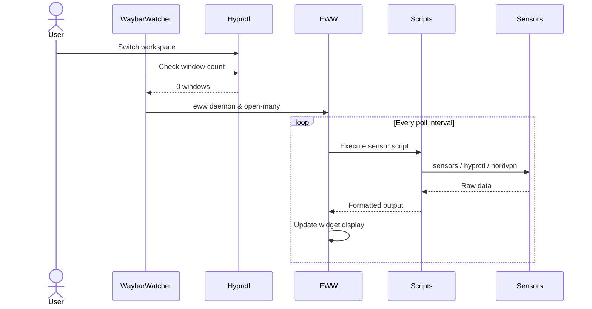

# Solution Design Document

## Validation Checklist

- [x] All required sections are complete
- [x] No [NEEDS CLARIFICATION] markers remain
- [x] All context sources are listed with relevance ratings
- [x] Project commands are discovered from actual project files
- [x] Constraints → Strategy → Design → Implementation path is logical
- [x] Architecture pattern is clearly stated with rationale
- [x] Every component in diagram has directory mapping
- [x] Every interface has specification
- [x] Error handling covers all error types
- [x] Quality requirements are specific and measurable
- [x] Every quality requirement has test coverage
- [x] **All architecture decisions confirmed by user** (5/5 ADRs confirmed)
- [x] Component names consistent across diagrams
- [x] A developer could implement from this design

---

## Constraints

**CON-1: Hardware Platform**
- MacBook Pro T2 with Intel Iris Plus 655 iGPU
- No NVIDIA or AMD discrete GPU
- applesmc kernel module provides fan/thermal sensors
- coretemp-isa-0000 provides CPU temps
- pch_cannonlake-virtual-0 provides PCH temps

**CON-2: Software Dependencies**
- eww (Elkowar's Wacky Widgets) - widget framework
- cava - audio visualizer backend
- lm-sensors - hardware sensor interface
- jq - JSON parsing for hyprctl output
- PipeWire audio system (not PulseAudio)
- NordVPN CLI for VPN status

**CON-3: Network Interface**
- T2 WiFi adapter presents as `wlan0` (not `wlp4s0`)
- Must update all network scripts to use correct interface name

**CON-4: Existing Architecture**
- Must preserve eww widget architecture (.yuck + .scss)
- Must maintain waybar_watcher.sh integration pattern
- Must keep file organization (scripts/{sys,net,audio,bar,ascii})

## Implementation Context

**IMPORTANT**: You MUST read and analyze ALL listed context sources to understand constraints, patterns, and existing architecture.

### Required Context Sources

```yaml
# Internal documentation and patterns
- doc: dotfiles/eww/README.md
  relevance: HIGH
  why: "Documents current eww setup and launch commands"

- doc: dotfiles/cava/README.md
  relevance: MEDIUM
  why: "Documents cava integration with eww"

# External documentation
- url: https://elkowar.github.io/eww/
  relevance: HIGH
  sections: [configuration, widgets, defpoll]
  why: "Official eww documentation for widget syntax"

- url: https://wiki.t2linux.org/
  relevance: MEDIUM
  sections: [audio, fan-control]
  why: "T2-specific Linux documentation"
```

### ICO-1: EWW Configuration
```yaml
# Core eww files that must be modified
- file: dotfiles/eww/eww.yuck
  relevance: HIGH
  sections: [defpoll variables, line 41-73 sensor polling]
  why: "Main eww config - sensor polling definitions need T2 adaptation"

- file: dotfiles/eww/eww.scss
  relevance: LOW
  why: "Styling - no changes needed for T2 port"

- file: dotfiles/eww/eww-state.yml
  relevance: LOW
  why: "State persistence - no changes needed"
```

### ICO-2: System Sensor Scripts
```yaml
# Scripts requiring modification for T2
- file: dotfiles/eww/scripts/sys/sys_cpu_voltage.sh
  relevance: HIGH
  why: "Must be removed or replaced - T2 doesn't expose CPU voltage"

- file: dotfiles/eww/scripts/sys/sys_gpu_voltage.sh
  relevance: HIGH
  why: "Must be removed - no dGPU voltage on T2"

- file: dotfiles/eww/scripts/sys/sys_dc_voltage.sh
  relevance: HIGH
  why: "Must be removed - AMD-specific vddnb not available"

- file: dotfiles/eww/scripts/sys/sys_fan_spin.sh
  relevance: HIGH
  why: "Must update sensor names from cpu_fan/gpu_fan to fan1/fan2"

- file: dotfiles/eww/scripts/sys/sys_workspace.sh
  relevance: LOW
  why: "No changes needed - uses hyprctl which is universal"
```

### ICO-3: Network Scripts
```yaml
# Scripts requiring interface name change
- file: dotfiles/eww/scripts/net/net_upload.sh
  relevance: HIGH
  why: "Change iface from wlp4s0 to wlan0"

- file: dotfiles/eww/scripts/net/net_download.sh
  relevance: HIGH
  why: "Change iface from wlp4s0 to wlan0"

- file: dotfiles/eww/scripts/net/net_vpn_status.sh
  relevance: HIGH
  why: "Replace strongSwan/ipsec with NordVPN CLI"
```

### ICO-4: Audio Integration
```yaml
# Audio pipeline files
- file: dotfiles/cava/config
  relevance: HIGH
  why: "Must update audio source to T2 PipeWire device"

- file: dotfiles/eww/scripts/audio/audio_visualizer.py
  relevance: LOW
  why: "No changes needed - reads from /tmp/cava.raw"
```

### Implementation Boundaries

- **Must Preserve**:
  - All .yuck widget definitions (window layouts)
  - All .scss styling (visual appearance)
  - waybar_watcher.sh switching logic
  - File organization structure

- **Can Modify**:
  - Shell scripts in scripts/{sys,net} directories
  - defpoll sensor commands in eww.yuck
  - cava config audio source

- **Must Not Touch**:
  - windows/*.yuck files (widget layouts work as-is)
  - eww.scss (styling is hardware-agnostic)
  - scripts/bar/bar_render.sh (pure bash, no hardware deps)

### External Interfaces

#### System Context Diagram

```mermaid
graph TB
    EWW[EWW Dashboard]

    User[User] --> EWW

    EWW --> Hyprctl[hyprctl API]
    EWW --> Sensors[lm-sensors]
    EWW --> Cava[Cava Audio]
    EWW --> Network[/proc/net/dev]
    EWW --> NordVPN[NordVPN CLI]
    EWW --> System[System Utils]

    Hyprctl --> Hyprland[Hyprland WM]
    Sensors --> ApplemSMC[applesmc module]
    Sensors --> CoreTemp[coretemp module]
    Sensors --> PCH[pch_cannonlake]
    Cava --> PipeWire[PipeWire Audio]
```

#### Interface Specifications

```yaml
# Inbound Interfaces (what triggers eww updates)
inbound:
  - name: "Timer-based polling"
    type: defpoll
    format: Shell command output
    intervals: 0.2s - 30m depending on metric
    data_flow: "Periodic sensor readings"

# Outbound Interfaces (what eww calls)
outbound:
  - name: "lm-sensors"
    type: CLI
    format: Text parsing
    command: sensors
    data_flow: "Fan RPM, temps"
    criticality: HIGH

  - name: "hyprctl"
    type: CLI
    format: JSON
    command: hyprctl -j
    data_flow: "Workspace state, window info"
    criticality: HIGH

  - name: "NordVPN CLI"
    type: CLI
    format: Text parsing
    command: nordvpn status
    data_flow: "VPN connection state"
    criticality: MEDIUM

  - name: "Network stats"
    type: Filesystem
    format: /proc/net/dev
    data_flow: "Upload/download bytes"
    criticality: MEDIUM

  - name: "Cava output"
    type: File
    format: ASCII via /tmp/cava.raw
    data_flow: "Audio visualization data"
    criticality: LOW

# Data Interfaces
data:
  - name: "Sensor Cache"
    type: /tmp files
    data_flow: "Temporary state for animations"
    files: [/tmp/cpu_fan_frame, /tmp/gpu_fan_frame, /tmp/visualizer.txt]
```

### Project Commands

```bash
# Component: EWW Dashboard
Location: dotfiles/eww/

## Environment Setup
Install Dependencies: pacman -S eww jq curl lm_sensors
Audio Dependencies: pacman -S cava python-numpy
Verify Sensors: sensors-detect && sensors

## Development Commands
Start EWW Daemon: eww daemon
Open All Widgets: eww open-many active_workspace ascii_decor_frame audio_status cpu_ram_storage_bars four_boxes net_bars orange_workspace power-cooling_header_text power_mode_text right_fan_data right_internet_text visualizer_window welcome_text workspace_window_text
Close All Widgets: eww close-all
Reload Config: eww reload
Check Logs: eww logs

## Testing Commands
Test Single Script: bash dotfiles/eww/scripts/sys/sys_fan_spin.sh cpu
Test Sensor Reading: sensors | grep -i fan
Test Network Interface: cat /proc/net/dev | grep wlan0
Test VPN Status: nordvpn status
Test Cava Output: cat /tmp/cava.raw

## Audio Visualizer
Start Cava: cava -p ~/.config/cava/config &
Start Visualizer: python3 dotfiles/eww/scripts/audio/audio_visualizer.py &

## Watcher Integration
Start Full System: bash dotfiles/hypr/scripts/waybar_watcher.sh &
```

## Solution Strategy

- **Architecture Pattern**: Modular polling-based widget system with shell script backends
- **Integration Approach**: Minimal invasive changes - update only sensor-reading scripts and eww.yuck polling commands
- **Justification**: The existing architecture is sound; only the hardware-specific sensor queries need T2 adaptation
- **Key Decisions**:
  1. Preserve widget layout entirely - only modify data sources
  2. Remove unportable voltage widgets rather than creating fake data
  3. Add new T2-specific widgets (battery, PCH temp) using same patterns
  4. Keep dual-fan display with adapted sensor names

## Building Block View

### Components

```mermaid
graph LR
    subgraph "EWW Framework"
        EWW_YUCK[eww.yuck<br/>Main Config]
        EWW_SCSS[eww.scss<br/>Styling]
        WINDOWS[windows/*.yuck<br/>Widget Layouts]
    end

    subgraph "Data Scripts"
        SYS[scripts/sys/*<br/>System Sensors]
        NET[scripts/net/*<br/>Network Stats]
        AUDIO[scripts/audio/*<br/>Audio Viz]
        BAR[scripts/bar/*<br/>Bar Rendering]
    end

    subgraph "External Data"
        SENSORS[lm-sensors]
        HYPRCTL[hyprctl]
        NORDVPN[nordvpn CLI]
        PROCNET[/proc/net/dev]
        CAVA[cava → /tmp/cava.raw]
    end

    EWW_YUCK --> SYS
    EWW_YUCK --> NET
    EWW_YUCK --> AUDIO
    SYS --> SENSORS
    SYS --> HYPRCTL
    NET --> PROCNET
    NET --> NORDVPN
    AUDIO --> CAVA

    WINDOWS --> EWW_YUCK
    EWW_SCSS --> WINDOWS
```

### Directory Map

**Component**: EWW Dashboard (T2 Port)
```
dotfiles/eww/
├── eww.yuck                          # MODIFY: Update defpoll sensor commands
├── eww.scss                          # NO CHANGE
├── eww-state.yml                     # NO CHANGE
├── scripts/
│   ├── sys/
│   │   ├── sys_fan_spin.sh           # MODIFY: Change fan sensor names (left/right)
│   │   ├── sys_workspace.sh          # NO CHANGE
│   │   ├── sys_cpu_voltage.sh        # REPLACE: → sys_cpu_freq.sh (CPU frequency/governor)
│   │   ├── sys_gpu_voltage.sh        # REPLACE: → sys_ssd_temp.sh (NVMe temperature)
│   │   ├── sys_dc_voltage.sh         # REMOVE: Not needed (replaced above)
│   │   ├── sys_cpu_temp.sh           # NEW: Read coretemp Package id 0
│   │   ├── sys_pch_temp.sh           # NEW: Read pch_cannonlake temp1
│   │   ├── sys_ssd_temp.sh           # NEW: Read nvme-pci Composite temp
│   │   ├── sys_cpu_freq.sh           # NEW: Read CPU frequency/governor
│   │   └── sys_battery.sh            # NEW: Read BAT0 via upower
│   ├── net/
│   │   ├── net_upload.sh             # MODIFY: Change iface to wlan0
│   │   ├── net_download.sh           # MODIFY: Change iface to wlan0
│   │   ├── net_upload_bar.sh         # NO CHANGE
│   │   ├── net_download_bar.sh       # NO CHANGE
│   │   ├── net_ping.sh               # NO CHANGE
│   │   ├── net_ping_latency.sh       # NO CHANGE
│   │   ├── net_vpn.sh                # MODIFY: Use nordvpn CLI
│   │   ├── net_vpn_bar.sh            # NO CHANGE
│   │   └── net_vpn_status.sh         # MODIFY: Use nordvpn CLI
│   ├── audio/
│   │   ├── audio_visualizer.py       # NO CHANGE
│   │   └── audio_cava_status.sh      # NO CHANGE
│   ├── bar/
│   │   └── bar_render.sh             # NO CHANGE
│   └── ascii/
│       └── ascii_core_layout.sh      # NO CHANGE
└── windows/
    ├── sys/
    │   └── thermal_display.yuck      # NEW: Multi-thermal widget (CPU, PCH, SSD)
    ├── misc/
    │   └── battery_widget.yuck       # NEW: Battery status widget
    └── [other dirs]                  # NO CHANGES

dotfiles/cava/
└── config                            # MODIFY: Update audio source
```

### Interface Specifications

#### Data Storage Changes

Not applicable - eww uses ephemeral /tmp files for state, no persistent storage.

#### Internal API Changes

Not applicable - eww uses shell script outputs, not HTTP APIs.

#### Application Data Models

```yaml
# Sensor Data Models (shell script outputs)

FanData:
  left_rpm: integer (0-7000)
  right_rpm: integer (0-7000)
  left_spinner: string (|, /, -, \)
  right_spinner: string (|, /, -, \)
  source: "sensors | grep fan1/fan2"

TemperatureData:
  cpu_temp: string ("57°C")
  pch_temp: string ("53°C")
  source_cpu: "sensors | grep 'Package id 0'"
  source_pch: "sensors | grep pch_cannonlake"

NetworkData:
  upload_percent: integer (0-100)
  download_percent: integer (0-100)
  ping_ms: integer
  interface: "wlan0"

VPNData:
  status: string ("Connected" | "Disconnected")
  country: string (optional)
  source: "nordvpn status"

BatteryData:
  percentage: integer (0-100)
  status: string ("Charging" | "Discharging" | "Full")
  time_remaining: string
  source: "upower -i /org/freedesktop/UPower/devices/battery_BAT0"
```

#### Integration Points

```yaml
# T2 Hardware Integration (replacing ASUS/AMD)
applesmc_sensors:
  - endpoint: "sensors | grep applesmc"
  - data: [fan1, fan2, TC0E, TCGC, etc.]
  - integration: "Parse specific lines for fan RPM"

coretemp_sensors:
  - endpoint: "sensors | grep coretemp"
  - data: [Package id 0, Core 0-3]
  - integration: "Parse Package id 0 for CPU temp"

pch_sensors:
  - endpoint: "sensors | grep pch_cannonlake"
  - data: [temp1]
  - integration: "Parse temp1 for PCH temp"

nordvpn_cli:
  - endpoint: "nordvpn status"
  - data: [Status, Country, City, IP]
  - integration: "Parse Status line for connection state"
```

### Implementation Examples

#### Example: T2 Fan Sensor Reading

**Why this example**: Shows the critical change from AMD cpu_fan/gpu_fan to Apple fan1/fan2

```bash
#!/usr/bin/env bash
# sys_fan_spin.sh - T2 ADAPTED VERSION
# Key change: sensor names fan1/fan2 instead of cpu_fan/gpu_fan

SPIN=('|' '/' '-' '\\')
fan="$1"  # "left" or "right"

cache="/tmp/${fan}_fan_frame"
[ -f "$cache" ] && index=$(<"$cache") || index=0
index=$(( (index + 1) % ${#SPIN[@]} ))
echo "$index" > "$cache"

# T2-SPECIFIC: Use fan1 for left, fan2 for right
if [ "$fan" = "left" ]; then
  rpm=$(sensors | grep -E "^fan1:" | awk '{print $2}')
elif [ "$fan" = "right" ]; then
  rpm=$(sensors | grep -E "^fan2:" | awk '{print $2}')
fi
[ -z "$rpm" ] && rpm=0

if [ "$rpm" -eq 0 ]; then
  echo "|"
else
  echo "${SPIN[$index]}"
fi
```

#### Example: NordVPN Status Integration

**Why this example**: Replaces strongSwan/ipsec with NordVPN CLI

```bash
#!/usr/bin/env bash
# net_vpn_status.sh - NORDVPN VERSION

status=$(nordvpn status 2>/dev/null)

if echo "$status" | grep -q "Status: Connected"; then
  country=$(echo "$status" | grep "Country:" | cut -d: -f2 | xargs)
  echo "[VPN: $country]"
else
  echo "[VPN: OFF]"
fi
```

#### Example: CPU Temperature Reading (T2)

**Why this example**: New script for T2-specific coretemp reading

```bash
#!/usr/bin/env bash
# sys_cpu_temp.sh - T2 VERSION

# Read Package id 0 from coretemp-isa-0000
temp=$(sensors | grep "Package id 0:" | awk '{print $4}')
echo "${temp:-N/A}"
```

## Runtime View

### Primary Flow

#### Primary Flow: Dashboard Display on Empty Workspace

1. User switches to empty workspace (no windows)
2. waybar_watcher.sh detects window_count == 0
3. eww daemon starts (if not running)
4. eww open-many launches all widgets
5. defpoll timers begin executing sensor scripts
6. Widgets render with live data
7. User opens a window → waybar_watcher closes eww, shows waybar



### Error Handling

- **Sensor not available**: Script outputs "N/A" string, widget displays gracefully
- **Network interface down**: Upload/download scripts return 0, bars show empty
- **NordVPN not installed**: VPN script outputs "[VPN: N/A]"
- **Cava not running**: Visualizer shows "standby" text
- **eww daemon crash**: waybar_watcher restarts on next cycle

### Complex Logic

Not applicable - all logic is simple shell scripts with sensor parsing.

## Deployment View

### Single Application Deployment

- **Environment**: User's Hyprland session on T2 MacBook
- **Configuration**:
  - eww config at ~/.config/eww/
  - cava config at ~/.config/cava/config
  - Sensor modules loaded (applesmc, coretemp)
- **Dependencies**: eww, cava, lm-sensors, jq, curl, python3, numpy, nordvpn
- **Performance**: Poll intervals tuned for <1% CPU overhead

### Deployment Steps

1. Ensure lm-sensors configured: `sudo sensors-detect`
2. Install dependencies: `pacman -S eww cava jq python-numpy`
3. Symlink configs: `ln -sf ~/balder/dotfiles/eww ~/.config/eww`
4. Symlink cava: `ln -sf ~/balder/dotfiles/cava ~/.config/cava`
5. Update Hyprland to exec waybar_watcher.sh
6. Verify: `eww open-many ...` works without errors

## Cross-Cutting Concepts

### Pattern Documentation

```yaml
# Existing patterns used
- pattern: Shell script polling via eww defpoll
  relevance: CRITICAL
  why: "Core pattern for all sensor data acquisition"

- pattern: /tmp file state caching
  relevance: MEDIUM
  why: "Used for animation frame persistence"
```

### System-Wide Patterns

- **Security**: No elevated privileges needed for sensors (applesmc is user-readable)
- **Error Handling**: All scripts have fallback outputs (echo "N/A" or "0")
- **Performance**: Staggered poll intervals (0.2s for animations, 5-10s for sensors)
- **Logging**: waybar_watcher.sh logs to /tmp/waybar_watcher_loop_final.log

### Implementation Patterns

#### Component Structure Pattern

```pseudocode
# eww defpoll pattern
DEFPOLL: sensor_variable
  INTERVAL: appropriate_for_metric (0.2s-30m)
  COMMAND: "bash script.sh || echo 'fallback'"

WIDGET: display_component
  USES: sensor_variable
  RENDERS: formatted display
```

#### Error Handling Pattern

```pseudocode
# All sensor scripts follow this pattern
FUNCTION: read_sensor()
  TRY: parse_sensor_output
  ON_FAILURE: echo "N/A" OR echo "0"
  NEVER: exit with error code
  ALWAYS: produce valid output for eww
```

## Architecture Decisions

- [x] **ADR-1: Replace Voltage Widgets with T2-Relevant Data**
  - Choice: Replace 3 voltage widgets with CPU frequency/governor and SSD temperature
  - Rationale: T2 doesn't expose voltage sensors; repurpose widget space for useful T2 data
  - Trade-offs: Different data than original, but more relevant
  - User confirmed: **2025-12-16**

- [x] **ADR-2: Rename Fan Scripts to Left/Right**
  - Choice: Change fan script parameters from cpu/gpu to left/right
  - Rationale: T2 has two identical cooling fans, not CPU/GPU-specific
  - Trade-offs: Minor eww.yuck changes needed
  - User confirmed: **2025-12-16**

- [x] **ADR-3: Add Battery Widget**
  - Choice: Add new dedicated battery status widget using upower
  - Rationale: Critical for laptop use; high user value
  - Trade-offs: Adds new widget not in original ASUS config
  - User confirmed: **2025-12-16**

- [x] **ADR-4: Use NordVPN CLI for VPN Status**
  - Choice: Replace strongSwan/ipsec with `nordvpn status` command
  - Rationale: User uses NordVPN, not strongSwan
  - Trade-offs: Requires nordvpn package installed
  - User confirmed: **2025-12-16**

- [x] **ADR-5: Multi-Thermal Display**
  - Choice: Create unified thermal section showing CPU, PCH, and SSD temperatures
  - Rationale: Fuller thermal picture from multiple zones
  - Trade-offs: More complex widget, but comprehensive monitoring
  - User confirmed: **2025-12-16**

## Quality Requirements

- **Performance**: All poll scripts complete in <100ms
- **Reliability**: Dashboard stable for 24+ hour sessions
- **Usability**: All widgets readable at default font sizes
- **Maintainability**: Scripts under 50 lines each, well-commented

## Risks and Technical Debt

### Known Technical Issues

- Original eww.yuck has hardcoded nvidia-smi calls that will fail on T2
- Some defpoll commands reference sensors that don't exist on T2
- cava source in config file is ASUS-specific

### Technical Debt

- Original code mixes cpu_fan/gpu_fan naming (not applicable to T2)
- Some scripts have redundant code (e.g., duplicate bar_render.sh)

### Implementation Gotchas

- applesmc fan sensor format: `fan1: 2433 RPM` (note the space before RPM)
- coretemp format: `Package id 0: +57.0°C` (note the + prefix)
- NordVPN CLI requires daemon running: `nordvpnd.service`
- PipeWire source names differ from PulseAudio - must use `pactl list sources`

## Test Specifications

### Critical Test Scenarios

**Scenario 1: Dashboard Launches Successfully**
```gherkin
Given: eww daemon is running
And: All sensor modules loaded (applesmc, coretemp)
When: eww open-many is executed with all widgets
Then: All 13 widgets render without errors
And: No error messages in eww logs
```

**Scenario 2: Fan Sensors Read Correctly**
```gherkin
Given: applesmc module loaded
When: sys_fan_spin.sh left is executed
Then: Output is one of |, /, -, \
And: No error messages produced
```

**Scenario 3: Network Stats with wlan0**
```gherkin
Given: WiFi connected via wlan0 interface
When: net_upload.sh is executed
Then: Output is integer 0-100
And: Uses wlan0 interface (not wlp4s0)
```

**Scenario 4: VPN Status with NordVPN**
```gherkin
Given: NordVPN daemon running
When: net_vpn_status.sh is executed
Then: Output matches pattern "[VPN: *]"
And: Shows country when connected
```

### Test Coverage Requirements

- **Sensor Scripts**: Each script tested with mock sensor output
- **Error Paths**: Each script tested with missing sensor data
- **Integration**: Full dashboard launch test
- **Visual**: Manual inspection of widget rendering

---

## Glossary

### Domain Terms

| Term | Definition | Context |
|------|------------|---------|
| applesmc | Apple System Management Controller kernel module | Exposes fan sensors on T2 Macs |
| coretemp | Intel CPU temperature kernel module | Provides Package and Core temps |
| PCH | Platform Controller Hub (Intel chipset) | Secondary thermal zone to monitor |
| defpoll | eww polling mechanism | Executes shell commands at intervals |

### Technical Terms

| Term | Definition | Context |
|------|------------|---------|
| eww | Elkowar's Wacky Widgets | Widget framework for Linux |
| .yuck | eww configuration file format | Lisp-like syntax for widget definitions |
| cava | Console-based Audio Visualizer for ALSA | Backend for audio visualization |

### API/Interface Terms

| Term | Definition | Context |
|------|------------|---------|
| hyprctl | Hyprland control utility | Used for workspace/window queries |
| nordvpn | NordVPN CLI tool | Used for VPN status queries |
| sensors | lm-sensors command | Used for hardware sensor queries |
