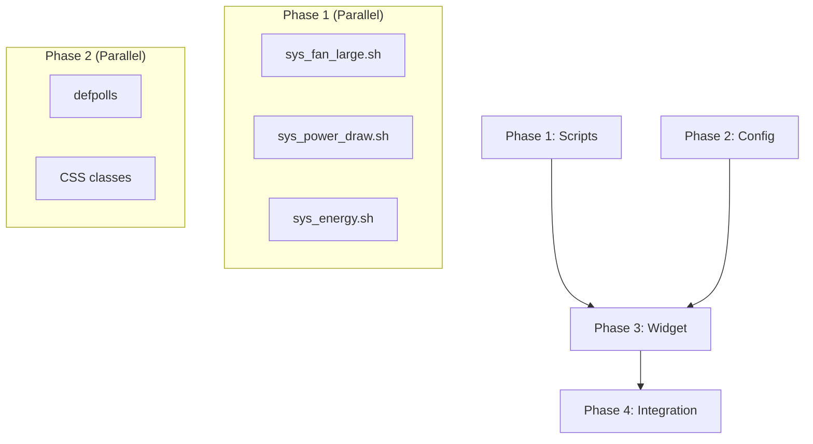

# Implementation Plan

## Validation Checklist

- [x] All specification file paths are correct and exist
- [x] Context priming section is complete
- [x] All implementation phases are defined
- [x] Each phase follows TDD: Prime → Test → Implement → Validate
- [x] Dependencies between phases are clear (no circular dependencies)
- [x] Parallel work is properly tagged with `[parallel: true]`
- [x] Activity hints provided for specialist selection `[activity: type]`
- [x] Every phase references relevant SDD sections
- [x] Every test references PRD acceptance criteria
- [x] Integration & E2E tests defined in final phase
- [x] Project commands match actual project setup
- [x] A developer could follow this plan independently

---

## Specification Compliance Guidelines

### How to Ensure Specification Adherence

1. **Before Each Phase**: Read referenced SDD/PRD sections
2. **During Implementation**: Follow exact patterns from SDD
3. **After Each Task**: Test against acceptance criteria
4. **Phase Completion**: Run `eww reload` and visual verification

### Deviation Protocol

If implementation cannot follow specification exactly:
1. Document the deviation and reason
2. Get approval before proceeding
3. Update SDD if the deviation is an improvement
4. Never deviate without documentation

## Metadata Reference

- `[parallel: true]` - Tasks that can run concurrently
- `[ref: document/section; lines: X-Y]` - Links to specifications
- `[activity: type]` - Activity hint for specialist agent selection

---

## Context Priming

*GATE: You MUST fully read all files mentioned in this section before starting any implementation.*

**Specification**:
- `docs/specs/005-eww-fan-dashboard-redesign/product-requirements.md` - Product Requirements
- `docs/specs/005-eww-fan-dashboard-redesign/solution-design.md` - Solution Design

**Key Design Decisions**:
- Single consolidated window replacing 3 old widgets
- Horizontal layout: Fan | Metrics | Fan
- UPower for power/energy metrics (not lm-sensors voltage)
- 0.3s animation interval for large ASCII fan art
- Green for charging, orange for discharging
- Cyrillic labels: мощность, энергия, об/мин, Вт·ч

**Implementation Context**:
- Commands to run:
  ```bash
  eww daemon                    # Start daemon if not running
  eww reload                    # Hot-reload config
  eww open fan_dashboard        # Test widget
  eww logs                      # Debug issues
  sensors | grep fan            # Verify fan sensors
  upower -i /org/freedesktop/UPower/devices/battery_BAT0  # Verify UPower
  ```
- Patterns to follow: `[ref: SDD/Building Block View]`
- Interfaces to implement: `[ref: SDD/Interface Specifications]`

---

## Implementation Phases

### Phase 1: Data Scripts

Create the backend scripts that fetch sensor data. Scripts can be developed in parallel.

- [ ] **T1 Create Data Scripts** `[ref: SDD/Interface Specifications]`

    - [ ] T1.1 sys_fan_large.sh `[parallel: true]` `[activity: bash-scripting]`
        - [ ] T1.1.1 Prime: Read SDD fan art specification `[ref: SDD; lines: 180-210]`
        - [ ] T1.1.2 Implement: Create 3-frame ASCII fan art animation
            - Frame rotation stored in `/tmp/fan_large_{left|right}_frame`
            - Output 5-line ASCII art with `\n` separators
            - Handle RPM=0 case (static fan)
        - [ ] T1.1.3 Test: `bash ~/.config/eww/scripts/sys/sys_fan_large.sh left`
        - [ ] T1.1.4 Validate: Output is multi-line ASCII, advances frame on each call

    - [ ] T1.2 sys_power_draw.sh `[parallel: true]` `[activity: bash-scripting]`
        - [ ] T1.2.1 Prime: Read SDD power draw specification `[ref: SDD; lines: 212-230]`
        - [ ] T1.2.2 Implement: Query UPower for energy-rate and state
            - Parse `energy-rate:` value from upower output
            - Parse `state:` value (charging/discharging/fully-charged)
            - Format: `25.2W↑` (charging) or `25.2W↓` (discharging)
        - [ ] T1.2.3 Test: `bash ~/.config/eww/scripts/sys/sys_power_draw.sh`
        - [ ] T1.2.4 Validate: Output includes W value and correct arrow

    - [ ] T1.3 sys_energy.sh `[parallel: true]` `[activity: bash-scripting]`
        - [ ] T1.3.1 Prime: Read SDD energy specification `[ref: SDD; lines: 232-245]`
        - [ ] T1.3.2 Implement: Query UPower for energy in Wh
            - Parse `energy:` value from upower output
            - Format with Cyrillic unit: `34.4 Вт·ч`
        - [ ] T1.3.3 Test: `bash ~/.config/eww/scripts/sys/sys_energy.sh`
        - [ ] T1.3.4 Validate: Output is numeric value with Вт·ч suffix

    - [ ] T1.4 Validate All Scripts
        - [ ] T1.4.1 Verify error handling: unplug charger, check output changes
        - [ ] T1.4.2 Verify fallback: simulate UPower failure, expect "N/A"
        - [ ] T1.4.3 PRD compliance: scripts output formats match acceptance criteria `[ref: PRD; Features 1-4]`

---

### Phase 2: EWW Configuration

Add polling variables and CSS styles. These can be done in parallel.

- [ ] **T2 Configure EWW** `[ref: SDD/Building Block View]`

    - [ ] T2.1 Add defpolls to eww.yuck `[parallel: true]` `[activity: eww-config]`
        - [ ] T2.1.1 Prime: Read SDD defpoll specifications `[ref: SDD; lines: 280-310]`
        - [ ] T2.1.2 Implement: Add 7 defpoll variables
            - `fan_left_art` (0.3s interval)
            - `fan_right_art` (0.3s interval)
            - `fan_left_rpm` (5s interval)
            - `fan_right_rpm` (5s interval)
            - `power_draw` (5s interval)
            - `power_state` (5s interval)
            - `battery_energy` (10s interval)
        - [ ] T2.1.3 Test: `eww reload && eww get fan_left_rpm`
        - [ ] T2.1.4 Validate: All 7 variables return expected values

    - [ ] T2.2 Add CSS classes to eww.scss `[parallel: true]` `[activity: scss-styling]`
        - [ ] T2.2.1 Prime: Read SDD CSS specifications `[ref: SDD; lines: 350-400]`
        - [ ] T2.2.2 Implement: Add 6 CSS classes
            - `.fan-art` (12px monospace, pre whitespace)
            - `.fan-rpm` (11px monospace, secondary color)
            - `.fan-metric-label` (11px, secondary)
            - `.fan-metric-value` (12px, primary)
            - `.fan-metric-value-charging` (12px, green)
            - `.fan-metric-value-discharging` (12px, orange)
        - [ ] T2.2.3 Test: Visual inspection after eww reload
        - [ ] T2.2.4 Validate: Classes use existing theme variables `[ref: PRD; Constraints]`

    - [ ] T2.3 Validate Configuration
        - [ ] T2.3.1 Run `eww reload` without errors
        - [ ] T2.3.2 Verify no SCSS compilation errors in `eww logs`

---

### Phase 3: Widget Implementation

Create the main widget window. Depends on Phase 1 and Phase 2 completion.

- [ ] **T3 Create Widget** `[ref: SDD/Building Block View]`

    - [ ] T3.1 Prime Context
        - [ ] T3.1.1 Read SDD widget structure `[ref: SDD; lines: 315-350]`
        - [ ] T3.1.2 Review existing widget patterns `[ref: dotfiles/eww/windows/sys/four_boxes.yuck]`

    - [ ] T3.2 Implement fan_dashboard.yuck `[activity: eww-widget]`
        - [ ] T3.2.1 Create window definition with geometry
            - Anchor: top left, Monitor: 0
            - Geometry: x="0px" y="700px" width="420px" height="120px"
            - Stacking: bg, Exclusive: false, Focusable: false
        - [ ] T3.2.2 Create horizontal layout structure
            - Left column: fan art + RPM
            - Center column: power + energy metrics
            - Right column: fan art + RPM
        - [ ] T3.2.3 Add conditional styling for power_state
            - Use ternary: `{power_state == "charging" ? "class-a" : "class-b"}`
        - [ ] T3.2.4 Add include statement to eww.yuck

    - [ ] T3.3 Test Widget
        - [ ] T3.3.1 Run `eww open fan_dashboard`
        - [ ] T3.3.2 Verify layout matches PRD mockup `[ref: PRD; Visual Concept]`
        - [ ] T3.3.3 Verify fan animation plays smoothly (0.3s)
        - [ ] T3.3.4 Verify power color changes when plugging/unplugging charger

    - [ ] T3.4 Validate Against PRD
        - [ ] T3.4.1 Feature 1: Dual ASCII fan display ✓ `[ref: PRD; Feature 1]`
        - [ ] T3.4.2 Feature 2: RPM with об/мин ✓ `[ref: PRD; Feature 2]`
        - [ ] T3.4.3 Feature 3: Power draw with arrow + color ✓ `[ref: PRD; Feature 3]`
        - [ ] T3.4.4 Feature 4: Battery energy with Вт·ч ✓ `[ref: PRD; Feature 4]`
        - [ ] T3.4.5 Feature 5: Large ASCII art (3-5 lines) ✓ `[ref: PRD; Feature 5]`

---

### Phase 4: Integration & Cleanup

Final validation, launch script update, and removal of old widgets.

- [ ] **T4 Integration & End-to-End Validation**

    - [ ] T4.1 Full Dashboard Test
        - [ ] T4.1.1 Launch full dashboard with new widget
            ```bash
            eww open-many four_boxes cpu_ram_storage_bars net_bars \
                           ascii_decor_frame welcome_text \
                           workspace_window_text fan_dashboard
            ```
        - [ ] T4.1.2 Verify no overlap with other widgets
        - [ ] T4.1.3 Verify widget visible on desktop background
        - [ ] T4.1.4 Let run for 5 minutes, check `eww logs` for errors

    - [ ] T4.2 Edge Case Testing `[ref: PRD; Edge Cases]`
        - [ ] T4.2.1 Test with charger connected (green, ↑)
        - [ ] T4.2.2 Test on battery (orange, ↓)
        - [ ] T4.2.3 Test fully charged state
        - [ ] T4.2.4 Simulate sensor failure (verify "N/A" display)

    - [ ] T4.3 Performance Validation `[ref: SDD; Quality Requirements]`
        - [ ] T4.3.1 Verify fan data accuracy (compare with `sensors` CLI)
        - [ ] T4.3.2 Verify power data accuracy (compare with `upower` CLI)
        - [ ] T4.3.3 Verify animation smoothness at 0.3s
        - [ ] T4.3.4 Check CPU usage is reasonable

    - [ ] T4.4 Cleanup Old Widgets
        - [ ] T4.4.1 Remove from eww.yuck includes (if any)
        - [ ] T4.4.2 Delete `windows/sys/power_mode_text.yuck`
        - [ ] T4.4.3 Delete `windows/sys/power_cooling_header_text.yuck`
        - [ ] T4.4.4 Delete `windows/sys/right_fan_data.yuck`
        - [ ] T4.4.5 Remove old defpolls (power_draw, cpu_voltage, gpu_voltage, dc_voltage, power_mode)
        - [ ] T4.4.6 Remove old CSS classes if unused

    - [ ] T4.5 Update Launch Script
        - [ ] T4.5.1 Update README.md launch command
        - [ ] T4.5.2 Remove old windows from eww open-many command

    - [ ] T4.6 Final Validation
        - [ ] T4.6.1 Run full eww reload
        - [ ] T4.6.2 Open all dashboard windows
        - [ ] T4.6.3 All PRD requirements implemented `[ref: PRD; Validation Checklist]`
        - [ ] T4.6.4 Implementation follows SDD design `[ref: SDD; Validation Checklist]`
        - [ ] T4.6.5 No errors in eww logs
        - [ ] T4.6.6 Visual inspection matches design mockup

---

## Phase Dependencies



## Task Summary

| Phase | Tasks | Parallel | Dependencies |
|-------|-------|----------|--------------|
| Phase 1: Scripts | 4 groups (3 parallel) | Yes | None |
| Phase 2: Config | 3 groups (2 parallel) | Yes | None |
| Phase 3: Widget | 4 groups | No | Phase 1, 2 |
| Phase 4: Integration | 6 groups | No | Phase 3 |

**Total: 17 task groups, ~45 individual tasks**
