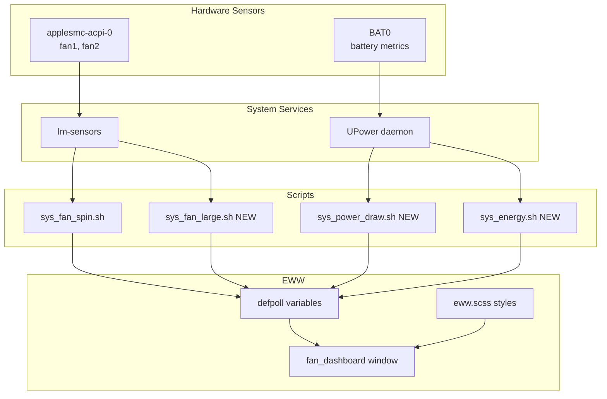
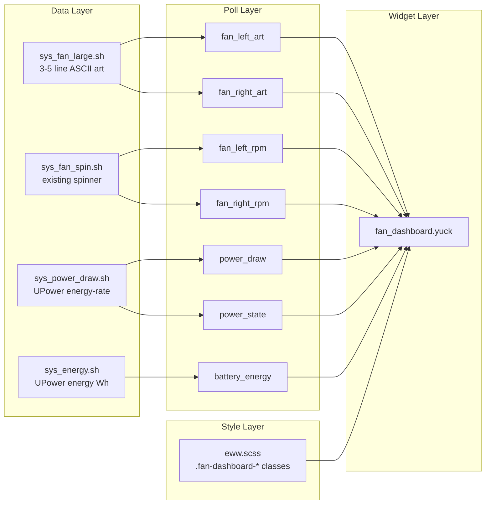
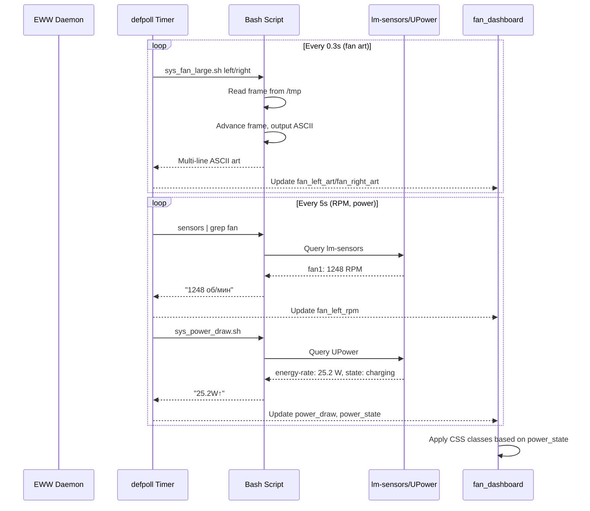

# Solution Design Document

## Validation Checklist

- [x] All required sections are complete
- [x] No [NEEDS CLARIFICATION] markers remain
- [x] All context sources are listed with relevance ratings
- [x] Project commands are discovered from actual project files
- [x] Constraints → Strategy → Design → Implementation path is logical
- [x] Architecture pattern is clearly stated with rationale
- [x] Every component in diagram has directory mapping
- [x] Every interface has specification
- [x] Error handling covers all error types
- [x] Quality requirements are specific and measurable
- [x] Every quality requirement has test coverage
- [x] **All architecture decisions confirmed by user**
- [x] Component names consistent across diagrams
- [x] A developer could implement from this design

---

## Constraints

**CON-1 Platform & Framework**
- EWW widget system (yuck + scss)
- Arch Linux with Hyprland compositor
- T2 MacBook Pro hardware (Intel CPU, Apple T2 chip)

**CON-2 Sensor Availability**
- Fan data: `applesmc-acpi-0` via lm-sensors (`fan1:`, `fan2:`)
- Power data: UPower daemon (`energy-rate`, `energy`, `state`)
- Must handle sensor unavailability gracefully

**CON-3 Visual Consistency**
- Must use existing theme variables from `eww.scss`
- Must follow established class naming patterns
- Must match existing dashboard aesthetic (Nord theme, Cyrillic labels)

## Implementation Context

### Required Context Sources

```yaml
# Internal patterns - CRITICAL
- file: dotfiles/eww/eww.yuck
  relevance: HIGH
  why: "Contains all defpoll patterns and variable definitions"

- file: dotfiles/eww/eww.scss
  relevance: HIGH
  why: "Theme variables and CSS class patterns"

- file: dotfiles/eww/windows/sys/four_boxes.yuck
  relevance: MEDIUM
  why: "Example of well-structured multi-element widget"

- file: dotfiles/eww/windows/net/net_bars.yuck
  relevance: MEDIUM
  why: "Recently refactored, shows consolidation pattern"

- file: dotfiles/eww/scripts/sys/sys_fan_spin.sh
  relevance: HIGH
  why: "Existing fan animation script to reuse/extend"

# External documentation
- url: https://elkowar.github.io/eww/
  relevance: MEDIUM
  why: "EWW widget framework documentation"
```

### Implementation Boundaries

- **Must Preserve**: Existing theme variables, show_eww visibility pattern, font families
- **Can Modify**: eww.yuck (add defpolls), eww.scss (add classes), launch script
- **Must Not Touch**: Other window definitions, existing scripts (except fan_spin.sh)

### External Interfaces

#### System Context Diagram



#### Interface Specifications

```yaml
# Data Sources (Inbound)
inbound:
  - name: "lm-sensors"
    type: CLI command
    format: Text parsing
    data_flow: "Fan RPM readings (fan1, fan2)"

  - name: "UPower"
    type: D-Bus / CLI
    format: Key-value text
    data_flow: "Battery state, energy-rate, energy"

# Widget Output (Outbound)
outbound:
  - name: "EWW Renderer"
    type: X11/Wayland compositor
    format: Widget tree
    data_flow: "Visual widget on desktop background"
```

### Project Commands

```bash
# EWW Development Commands
Location: dotfiles/eww/

## Testing Widget
eww daemon                          # Start EWW daemon
eww open fan_dashboard              # Open specific window
eww close fan_dashboard             # Close specific window
eww reload                          # Hot-reload config changes
eww logs                            # View EWW debug logs

## Full Dashboard Launch
eww open-many four_boxes cpu_ram_storage_bars net_bars \
               ascii_decor_frame welcome_text \
               workspace_window_text fan_dashboard

## Script Testing
bash ~/.config/eww/scripts/sys/sys_fan_spin.sh left
bash ~/.config/eww/scripts/sys/sys_power_draw.sh
bash ~/.config/eww/scripts/sys/sys_energy.sh

## Sensor Verification
sensors | grep -E 'fan[12]:'
upower -i /org/freedesktop/UPower/devices/battery_BAT0
```

## Solution Strategy

- **Architecture Pattern**: Single consolidated widget following recent codebase consolidation trend (net module refactor merged 2 windows → 1)
- **Integration Approach**: Add new defpolls to eww.yuck, new window to windows/sys/, new scripts to scripts/sys/
- **Justification**: Matches existing patterns, maximizes code reuse, simplifies positioning
- **Key Decisions**:
  1. Single window for all fan + power data
  2. Reuse existing fan_spin.sh, extend for large ASCII art
  3. New UPower-based scripts for power metrics
  4. Horizontal layout: Fan | Metrics | Fan

## Building Block View

### Components



### Directory Map

```
dotfiles/eww/
├── eww.yuck                              # MODIFY: Add 7 new defpolls
├── eww.scss                              # MODIFY: Add .fan-dashboard-* classes
├── windows/sys/
│   ├── fan_dashboard.yuck                # NEW: Main widget
│   ├── power_mode_text.yuck              # DELETE: Replaced
│   ├── power_cooling_header_text.yuck    # DELETE: Replaced
│   └── right_fan_data.yuck               # DELETE: Replaced
└── scripts/sys/
    ├── sys_fan_spin.sh                   # KEEP: Existing spinner
    ├── sys_fan_large.sh                  # NEW: Large ASCII fan art
    ├── sys_power_draw.sh                 # NEW: Power draw from UPower
    └── sys_energy.sh                     # NEW: Battery energy from UPower
```

### Interface Specifications

#### Script: sys_fan_large.sh

**Purpose**: Generate 3-5 line ASCII fan art with rotation animation

**Input**: `$1` = fan identifier (`left` or `right`)

**Output**: Multi-line ASCII art string (newline-separated)

```bash
# Expected output format (3 frames rotating)
# Frame 0:
  ╭───╮
 ╱  │  ╲
│   │   │
 ╲  │  ╱
  ╰───╯

# Frame 1:
  ╭───╮
 ╱  ╲  ╲
│   ╳   │
 ╱  ╱  ╱
  ╰───╯

# Frame 2:
  ╭───╮
 ╲  ─  ╱
│───────│
 ╱  ─  ╲
  ╰───╯
```

**State**: Uses `/tmp/fan_large_{left|right}_frame` for animation state

#### Script: sys_power_draw.sh

**Purpose**: Get current power draw with charging state indicator

**Input**: None

**Output**: Formatted string with arrow and value

```bash
# Charging output:
25.2W↑

# Discharging output:
25.2W↓

# Fully charged output:
0.0W
```

#### Script: sys_energy.sh

**Purpose**: Get remaining battery energy in Wh

**Input**: None

**Output**: Formatted string with Cyrillic unit

```bash
# Output format:
34.4 Вт·ч
```

#### defpoll Variables (add to eww.yuck)

```yuck
;; ═══ FAN DASHBOARD ══════════════════════════════════════════════════════════

;; Large ASCII fan art (3-5 lines, animated)
(defpoll fan_left_art :interval "0.3s"
  "bash ~/.config/eww/scripts/sys/sys_fan_large.sh left || echo '  [?]  '")
(defpoll fan_right_art :interval "0.3s"
  "bash ~/.config/eww/scripts/sys/sys_fan_large.sh right || echo '  [?]  '")

;; Fan RPM with Cyrillic units
(defpoll fan_left_rpm :interval "5s"
  "sensors | grep -E '^fan1:' | awk '{print $2 \" об/мин\"}' || echo 'N/A'")
(defpoll fan_right_rpm :interval "5s"
  "sensors | grep -E '^fan2:' | awk '{print $2 \" об/мин\"}' || echo 'N/A'")

;; Power draw with arrow indicator
(defpoll power_draw :interval "5s"
  "bash ~/.config/eww/scripts/sys/sys_power_draw.sh || echo 'N/A'")

;; Charging state for color styling
(defpoll power_state :interval "5s"
  "upower -i /org/freedesktop/UPower/devices/battery_BAT0 | grep 'state:' | awk '{print $2}' || echo 'unknown'")

;; Battery energy in Wh
(defpoll battery_energy :interval "10s"
  "bash ~/.config/eww/scripts/sys/sys_energy.sh || echo 'N/A'")
```

#### Widget Structure (fan_dashboard.yuck)

```yuck
(defwindow fan_dashboard
  :visible show_eww
  :anchor "top left"
  :monitor 0
  :geometry (geometry :x "0px" :y "700px" :width "420px" :height "120px")
  :stacking "bg"
  :exclusive false
  :focusable false

  (box :orientation "horizontal" :halign "center" :spacing 15

    ;; LEFT FAN COLUMN
    (box :orientation "vertical" :halign "center" :valign "center" :spacing 2
      (label :text fan_left_art :class "fan-art")
      (label :text fan_left_rpm :class "fan-rpm"))

    ;; CENTER METRICS COLUMN
    (box :orientation "vertical" :halign "center" :valign "center" :spacing 8
      ;; Power draw
      (box :orientation "horizontal" :halign "start" :spacing 4
        (label :text "мощность:" :class "fan-metric-label")
        (label :text power_draw
               :class {power_state == "charging" ? "fan-metric-value-charging" : "fan-metric-value-discharging"}))
      ;; Battery energy
      (box :orientation "horizontal" :halign "start" :spacing 4
        (label :text "энергия:" :class "fan-metric-label")
        (label :text battery_energy :class "fan-metric-value")))

    ;; RIGHT FAN COLUMN
    (box :orientation "vertical" :halign "center" :valign "center" :spacing 2
      (label :text fan_right_art :class "fan-art")
      (label :text fan_right_rpm :class "fan-rpm"))))
```

#### CSS Classes (add to eww.scss)

```scss
// ═══ FAN DASHBOARD ══════════════════════════════════════════════════════════

.fan-art {
  font-size: 12px;
  font-family: "JetBrainsMono Nerd Font", monospace;
  color: $color-primary;
  letter-spacing: 1px;
  white-space: pre;  // Preserve ASCII art formatting
}

.fan-rpm {
  font-size: 11px;
  font-family: monospace;
  color: $color-secondary;
  font-weight: bold;
}

.fan-metric-label {
  font-size: 11px;
  font-family: monospace;
  color: $color-secondary;
}

.fan-metric-value {
  font-size: 12px;
  font-family: monospace;
  color: $color-primary;
  font-weight: bold;
}

.fan-metric-value-charging {
  font-size: 12px;
  font-family: monospace;
  color: #a6e3a1;  // Green for charging (Catppuccin green)
  font-weight: bold;
}

.fan-metric-value-discharging {
  font-size: 12px;
  font-family: monospace;
  color: $color-orange;  // Orange for discharging
  font-weight: bold;
}
```

## Runtime View

### Primary Flow: Widget Rendering Cycle

1. EWW daemon starts, loads eww.yuck
2. defpoll timers trigger script execution
3. Scripts read sensors/UPower, format output
4. Widget renders with updated variable values
5. CSS classes apply styling based on power_state
6. Repeat at configured intervals



### Error Handling

| Error Type | Detection | Response |
|------------|-----------|----------|
| UPower unavailable | Script returns empty | Display "N/A" |
| lm-sensors failure | grep returns nothing | Display "N/A" |
| Fan stopped (RPM=0) | Parsed value is 0 | Show static ASCII, "0 об/мин" |
| State file missing | -f check fails | Initialize to frame 0 |
| Unknown power state | state != charging/discharging | Use neutral color class |

## Deployment View

**No change to deployment infrastructure.**

- Widget loads automatically when eww.yuck is reloaded
- Scripts execute in user context
- No new services or daemons required

**Rollout Steps:**
1. Create new scripts in `scripts/sys/`
2. Add defpolls to `eww.yuck`
3. Create `fan_dashboard.yuck`
4. Add CSS to `eww.scss`
5. Test with `eww open fan_dashboard`
6. Add to launch command
7. Delete old widget files

## Cross-Cutting Concepts

### Pattern Documentation

```yaml
# Existing patterns used
- pattern: defpoll with error fallback
  why: "All defpolls must have || echo 'fallback' for resilience"

- pattern: CSS class conditional styling
  why: "Use yuck ternary for dynamic class assignment based on state"

- pattern: Stateful animation scripts
  why: "Use /tmp files to persist animation frame between invocations"

# New patterns created
- pattern: UPower integration
  why: "First EWW widget to use UPower for battery metrics"
```

### System-Wide Patterns

- **Error Handling**: Every script chains with `|| echo 'N/A'` or `|| echo 'null'`
- **Logging**: EWW logs available via `eww logs`
- **Performance**: Animation at 0.3s (not 0.2s) to reduce CPU load for larger ASCII

## Architecture Decisions

- [x] **ADR-1: Single consolidated window**
  - Rationale: Follows recent net_bars consolidation pattern, simplifies positioning
  - Trade-offs: Less flexibility to hide individual fans
  - User confirmed: ✅ (in PRD phase)

- [x] **ADR-2: UPower for power metrics**
  - Rationale: Provides calculated energy-rate in watts, handles state detection
  - Trade-offs: Adds dependency on UPower daemon running
  - User confirmed: ✅ (implicit - we researched what sensors work on T2)

- [x] **ADR-3: Large ASCII fan art (3-5 lines)**
  - Rationale: User specified compact but visible size
  - Trade-offs: More complex rendering, higher update frequency
  - User confirmed: ✅ (in PRD phase)

- [x] **ADR-4: Horizontal layout (Fan-Metrics-Fan)**
  - Rationale: User specified this arrangement
  - Trade-offs: Wider widget footprint
  - User confirmed: ✅ (in PRD phase)

- [x] **ADR-5: Color-coded power state**
  - Rationale: Green for charging, orange for discharging - intuitive
  - Trade-offs: Requires conditional CSS class in yuck
  - User confirmed: ✅ (in PRD phase)

- [x] **ADR-6: Animation interval 0.3s (not 0.2s)**
  - Rationale: Larger ASCII art = more CPU per render, 0.3s still smooth
  - Trade-offs: Slightly less fluid animation
  - User confirmed: ✅

## Quality Requirements

| Requirement | Target | Measurement |
|-------------|--------|-------------|
| Fan data accuracy | ±1 RPM | Compare with `sensors` CLI |
| Power data accuracy | ±0.1W | Compare with UPower CLI |
| Animation smoothness | 0.3s updates | Visual inspection |
| Widget load time | <100ms | EWW logs |
| Error resilience | 100% uptime | No crashes when sensors fail |

## Risks and Technical Debt

### Known Technical Issues
- Current widgets reference undefined `show_eww` variable (fixed in new design)
- Old scripts use AMD-specific sensors that don't exist on T2

### Technical Debt
- Existing `sys_fan_spin.sh` duplicates logic - could be refactored
- Multiple polling for same sensor data - could optimize

### Implementation Gotchas
- EWW doesn't support true multi-line labels easily - use `white-space: pre` CSS
- UPower output format may vary - parse defensively
- `/tmp` files may be cleaned on reboot - scripts handle missing files

## Test Specifications

### Critical Test Scenarios

**Scenario 1: Normal Operation**
```gherkin
Given: EWW daemon running, sensors available
When: fan_dashboard window opens
Then: Both fans display animated ASCII art
And: RPM values show with "об/мин" suffix
And: Power shows with arrow (↑ or ↓) and color
And: Energy shows with "Вт·ч" suffix
```

**Scenario 2: Charging State**
```gherkin
Given: Laptop connected to AC power
When: UPower reports state=charging
Then: Power value shows green color
And: Arrow shows ↑ (up)
```

**Scenario 3: Discharging State**
```gherkin
Given: Laptop on battery power
When: UPower reports state=discharging
Then: Power value shows orange color
And: Arrow shows ↓ (down)
```

**Scenario 4: Sensor Failure**
```gherkin
Given: lm-sensors or UPower unavailable
When: Script fails to get data
Then: Widget displays "N/A" for affected values
And: Widget does not crash or hang
```

### Test Coverage Requirements

- **Scripts**: Test each script outputs expected format
- **defpolls**: Verify variables update at configured intervals
- **CSS**: Verify color classes apply correctly
- **Layout**: Verify Fan-Metrics-Fan horizontal arrangement
- **Edge cases**: Fan RPM=0, battery full, no charger

---

## Glossary

### Domain Terms

| Term | Definition | Context |
|------|------------|---------|
| об/мин | Russian for "RPM" (оборотов в минуту) | Fan speed unit |
| Вт·ч | Russian for "Wh" (ватт-часы) | Battery energy unit |
| мощность | Russian for "power" | Power draw label |
| энергия | Russian for "energy" | Battery energy label |

### Technical Terms

| Term | Definition | Context |
|------|------------|---------|
| defpoll | EWW variable that polls a command at interval | Data binding |
| applesmc | Apple System Management Controller | Kernel module for T2 Mac sensors |
| UPower | D-Bus service for power device info | Battery metrics source |
| energy-rate | Watts flowing in/out of battery | Power consumption metric |
